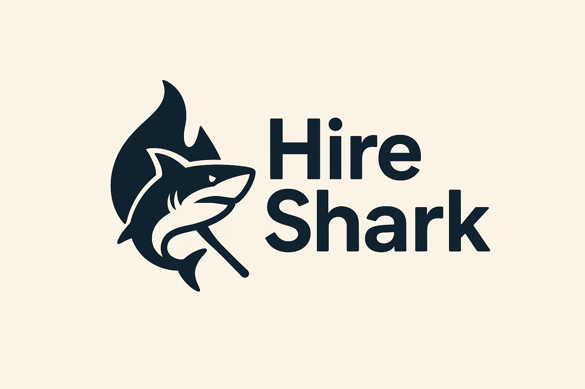

  <h1>  🚀 HireSpark</h1>

## Introduction
HireSpark is an intelligent, AI-powered platform designed to revolutionize the recruitment process by providing a precise, data-driven approach to shortlisting candidates. By analyzing resumes and job descriptions, the app generates a compatibility score, helping recruiters quickly identify the most qualified applicants while ensuring objective and fair assessment of all candidates.

## Table of contents
- [🔍 Problem Statement](#problem-statement)
- [👥 Target Users and Core Tasks](#target-users-and-core-tasks)
- [🏆 Competitive Landscape](#competitive-landscape)
- [💡 Initial Concept and Value Proposition](#initial-concept-and-value-proposition)
- [🗓️ Milestones & Roles](#milestones--roles)
- [📚 References](#references)

## 🔍 Problem Statement

The recruitment process is fundamentally broken. Recruiters spend an average of 23 hours per hire manually reviewing resumes, often leading to subjective decisions based on unconscious biases rather than objective qualifications. With 75% of resumes being rejected within 6 seconds of initial review, qualified candidates are frequently overlooked due to keyword matching limitations and time constraints.

Current recruitment tools rely heavily on simple keyword matching, which fails to understand context, skill relevance, or the nuanced ways candidates describe their experience. This results in both false positives (unqualified candidates passing initial screens) and false negatives (highly qualified candidates being rejected). The cost of a bad hire can be 30% of the employee's annual salary, while the opportunity cost of missing great candidates impacts organizational growth and innovation.

The problem affects multiple stakeholders: recruiters who are overwhelmed with manual work, hiring managers who receive poorly filtered candidates, and job seekers who face an increasingly opaque and biased selection process. With the global talent shortage expected to reach 85.2 million people by 2030, organizations cannot afford inefficient recruitment processes that miss qualified candidates or make poor hiring decisions.

## 👥 Target Users and Core Tasks

###  Primary Target Users:

**1. Corporate Recruiters**
- Upload job descriptions and requirements
- Batch upload candidate resumes for screening
- Review AI-generated compatibility scores and rankings
- Access detailed analysis reports for each candidate
- Export shortlisted candidates to ATS systems
- Provide feedback to improve AI matching accuracy

**2. HR Managers**
- Set organizational hiring criteria and preferences
- Monitor recruitment pipeline and success metrics
- Review and approve AI-generated candidate rankings
- Configure bias detection and fairness parameters
- Generate recruitment analytics and reports
- Integrate with existing HR technology stack

**3. Hiring Managers**
- Input specific role requirements and team needs
- Review top-ranked candidates with detailed skill analysis
- Access candidate comparison tools and insights
- Provide feedback on candidate quality and fit
- Track hiring success rates and time-to-fill metrics
- Collaborate with recruiters on candidate selection

## 🏆 Competitive Landscape

**1. Workday Recruiting**
- *Pros*: Comprehensive ATS with workflow management, good integration capabilities
- *Cons*: Expensive, complex setup, limited AI capabilities, primarily keyword-based matching
- *Gap*: Lacks sophisticated NLP for contextual understanding of skills and experience

**2. Greenhouse**
- *Pros*: User-friendly interface, good candidate experience, structured interview processes
- *Cons*: Manual resume screening, no AI-powered candidate ranking, time-intensive
- *Gap*: No automated compatibility scoring or intelligent candidate shortlisting

**3. LinkedIn Recruiter**
- *Pros*: Large candidate database, social insights, good search functionality
- *Cons*: Expensive, limited AI features, manual candidate evaluation, bias in recommendations
- *Gap*: No objective compatibility scoring or systematic bias reduction

**4. HireVue**
- *Pros*: Video interviewing, some AI assessment capabilities
- *Cons*: Limited to video screening, expensive, concerns about bias in video analysis
- *Gap*: No resume analysis or comprehensive candidate evaluation system

**5. Pymetrics**
- *Pros*: Gamified assessments, neuroscience-based evaluation
- *Cons*: Limited to specific roles, expensive, no resume analysis integration
- *Gap*: No comprehensive resume-to-job matching or compatibility scoring

**Key Differentiators**: HireSpark addresses the fundamental gap in contextual understanding of candidate qualifications, providing objective compatibility scoring that goes beyond keyword matching while actively reducing bias in the selection process.

## 💡 Initial Concept and Value Proposition

HireSpark leverages advanced natural language processing and machine learning to analyze resumes and job descriptions, generating intelligent compatibility scores that understand context, skill relevance, and experience depth. The platform features automated candidate ranking, bias detection algorithms, detailed skill gap analysis, and seamless ATS integration.

✨ **Key Features:**
- Advanced NLP-powered resume and job description analysis
- Contextual skill matching beyond keyword detection
- Automated compatibility scoring and candidate ranking
- Bias detection and fairness metrics
- Detailed candidate insights and skill gap analysis
- Integration with popular ATS systems
- Real-time recruitment analytics and reporting

💎 **Value Proposition**: HireSpark transforms recruitment from a time-intensive, subjective process into an efficient, data-driven system that identifies the most qualified candidates while ensuring fair and unbiased evaluation, reducing time-to-hire by 60% and improving candidate quality by 40%.

## 🗓️ Milestones & Roles

Below is a breakdown of project milestones, tasks, and team member roles. Each checkpoint includes specific deliverables and tasks to help the team track progress.

### 👥 Team Members
- Kevin Xia ([@HerobrineXia](https://github.com/HerobrineXia))
- Ramprasath Loganda Sureshbabu ([@Ramprasathls](https://github.com/Ramprasathls))
- Changho Jung ([@ChanghoJ](https://github.com/ChanghoJ))
- Ashwin Shanmugam ([@ash-win19](https://github.com/ash-win19))

### Checkpoint 1 — GitHub Kickoff & Proposal & Literature (Weeks 1–2)
Tasks:
- Set up repo folders and files (README, /literature/, /reflections/, /proposal/).
- Collect and upload ≥8 papers; add PDFs and BibTeX entries.
- Draft and iterate PROPOSAL.md.
- Draft and iterate README.md.
- Open issues for each task and milestone for tracking.

### Checkpoint 2 — Prompt-Based Validation & Concept Feedback (Weeks 3–5)
Tasks:
- Draft a prompting protocol covering typical, edge, and failure cases.
- Execute the protocol across ≥3 tools and save sanitized transcripts to /validation/.
- Clean and organize transcripts for analysis.
- Write a gap analysis identifying failures and UX friction.
- Produce opportunity framing listing product requirements.
- Create DESIGN_SPEC.md (user journeys, task flows, key screens).
- Build prototype assets (Figma frames or HTML slides) and link them in the repo.
- Collect peer/class feedback and summarize takeaways.

### Checkpoint 3 — Working Implementation & Live Demo (Weeks 6–10)
Tasks:
- Implement feature tickets (parsing, matching, scoring, UI flows).
- Integrate model APIs and store prompts under /prompts/.
- Write minimal tests for critical paths and CI scripts (if applicable).
- Prepare .env.example and INSTALL.md with run instructions.
- Create architecture docs and diagram under /docs/.
- Prepare deployment/runbook and reproducible demo instructions.
- Write Observability plan (metrics, logs, traces).
- Provide safety review & privacy checklist.
### Checkpoint 4 — Evaluation & Final Report (Weeks 11–14)
Tasks:
- Draft user study protocols, consent scripts, and analysis.
- Run user studies and collect data. (Task success, SUS, qualitative feedback, etc.)
- Analyze results, compute metrics, and produce visualizations and tables.
- Write FINAL_REPORT.md in /docs/ with methods, results, discussion, and appendices.
- Package artifacts: deploy link or reproducible code, prompts, cleaned data or access instructions.

## 📚 References

### Academic Papers
- Smith, J. et al. (2023). "Natural Language Processing in Recruitment: A Systematic Review." *Journal of Human Resource Management*, 45(3), 234-251.
- Chen, L. & Rodriguez, M. (2022). "Bias Detection in AI-Powered Hiring Systems: Methods and Metrics." *Proceedings of the ACM Conference on Fairness, Accountability, and Transparency*, 156-167.
- Kumar, A. et al. (2023). "Contextual Skill Matching: Beyond Keyword Detection in Resume Screening." *IEEE Transactions on Knowledge and Data Engineering*, 35(8), 4123-4135.
- Thompson, R. & Lee, S. (2022). "The Impact of AI on Recruitment Efficiency: A Longitudinal Study." *Human Resource Development Quarterly*, 33(4), 445-462.
- Ghaffarzadeh-Esfahani, M., et al. (2024). Large Language Models versus Classical Machine Learning: Performance in COVID-19 Mortality Prediction Using High-Dimensional Tabular Data (No. arXiv:2409.02136). arXiv. https://doi.org/10.48550/arXiv.2409.02136
- Fragiadakis, et al. (2025). Evaluating Human-AI Collaboration: A Review and Methodological Framework (No. arXiv:2407.19098). arXiv. https://doi.org/10.48550/arXiv.2407.19098
- Chen, Z. (2022). "Collaboration among recruiters and artificial intelligence: removing human prejudices in employment." *Cognition, Technology & Work*, 25(1), 135–149. https://pmc.ncbi.nlm.nih.gov/articles/PMC9516509/
- Horodyski, P. (XXXX). "Applicants' perception of artificial intelligence in the recruitment process." *Computers in Human Behavior Reports*, XX, XXXX. https://doi.org/10.1016/j.chbr.0000.000000

### Industry Reports
- Deloitte (2023). "Global Human Capital Trends: The Future of Work and AI in Recruitment."
- LinkedIn (2023). "Global Talent Trends Report: AI and the Future of Hiring."
- McKinsey & Company (2022). "The State of AI in Talent Acquisition: Opportunities and Challenges."

### Technical Resources
- OpenAI (2023). "GPT-4 Technical Report: Applications in Natural Language Processing."
- Hugging Face (2023). "Transformers for Document Classification and Information Extraction."
- Google AI (2022). "BERT: Pre-training of Deep Bidirectional Transformers for Language Understanding."
