# HireShark Evaluation
Authors: Ashwin Shanmugam, Changho Jung, Kevin Xia, Ramprasath Loganda Sureshbabu

## Abstract 
Hiring platforms often leave applicants sifting through ill-fitted roles and manually tailoring applications. HireShark uses Gemini 2.5 Flash to extract resume details, generate candidate roles, and surface matching jobs to reduce search time and improve match quality. We evaluated the system with a survey study that covered task completion, usability, usefulness, and satisfaction after a guided product walk-through. Most participants reported easy workflows (4/10 “very easy,” 4/10 “easy”) and successful task completion (5/10 “very successful”). Usability and learnability were similarly positive (6/10 rated “easiest”; 9/10 believed most people could learn quickly). Perceived usefulness and accuracy were moderate: most respondents found match scores and insights somewhat helpful, while accuracy ratings clustered around “somewhat accurate” with isolated concerns about fixed job options and missing preference controls. Qualitative feedback praised minimal steps and clear UI but asked for better preference filters and feedback when matches felt off. Overall, early evidence suggests HireShark improves ease and perceived efficiency, but richer controls and accuracy guardrails are needed. 

## Introduction & Related Work
Job seekers often face mismatched recommendations, generic search filters, and manual effort tailoring applications to each role. Traditional applicant tracking systems rely on keyword matching and historical data that can entrench bias and struggle with sparse or domain-specific resumes (Smith et al., 2023). Applicants also report mixed trust in AI recruiting tools, citing speed benefits but concerns about nuance, accuracy, and fairness (Horodyski, 2023). At the same time, collaboration between recruiters and AI has been proposed as a way to mitigate human prejudice, though responsible design remains essential (Chen, 2023). Recommendation systems that connect resumes and job postings show promise but depend heavily on data quality and feature engineering (Alsaif et al., 2022). Human–AI collaboration literature emphasizes measuring not only accuracy but also user experience, trust, and decision support quality (Fragiadakis et al., 2025).

Two gaps emerge from this literature: (1) traditional pipelines optimize for recruiter-side efficiency and can overlook candidate agency, and (2) user trust hinges on transparency and control, not just predictive performance. Generative models offer flexibility beyond keyword matching but introduce new risks—hallucinated matches, opaque rationales, and potential bias amplification. A job-matching tool therefore must balance speed with explanation, give applicants levers to steer results, and surface evidence to justify scores. HireShark is designed with this balance in mind.

Problem statement: Can a generative AI–powered assistant make job search faster and easier without sacrificing perceived accuracy or agency? To answer, we examined whether users can complete core tasks, whether they understand and value the scores, and what controls are needed to trust the recommendations.

HireShark leverages generative AI (Gemini 2.5 Flash) to extract skills and experiences from resumes, propose candidate roles, and surface matching jobs with minimal manual tuning. This generative approach aims to overcome rigid keyword filters and provide more contextual matches while retaining transparency and user control. In doing so, it sits at the intersection of recommender systems (Alsaif et al., 2022), human–AI collaboration (Fragiadakis et al., 2025), and fairness/agency in recruitment tools (Horodyski, 2023; Chen, 2023). We take a formative evaluation stance to understand whether HireShark is not only usable but also trusted and perceived as accurate.

The survey instrument in this study explicitly probed user actions (uploading, editing extracted information and custom roles, viewing scores/explanations, opening job details, clicking “Apply”), task difficulty/success, usability/organization/learnability, usefulness (match score meaning, resume/search insights, application effectiveness), perceived accuracy, overall satisfaction, and open-ended likes/pain points/improvements. Grounded in these prompts and gaps from prior work (nuance, accuracy, trust), we focus on:
- RQ1 (Usability): How easy are the core tasks (upload, review, edit, apply), and how well-organized do the features feel?
- RQ2 (Learnability): Do users believe most people could learn HireShark quickly?
- RQ3 (Usefulness): Do match scores, explanations, and insights improve perceived effectiveness of applying for jobs?
- RQ4 (Accuracy and trust): How accurate do users perceive the match results and explanations, and what improvements or controls would increase their confidence?

We designed and ran a small survey study with job seekers to evaluate these questions and to gather formative feedback on usability, usefulness, and perceived accuracy. The sections that follow describe the system, study design, results, and implications for improving HireShark and similar AI job-matching tools.

Our contribution is threefold: (1) a description of a generative AI–powered job-matching workflow intended to reduce friction for applicants; (2) a formative user study with real job seekers that measures usability, perceived usefulness, and perceived accuracy; and (3) design implications that prioritize controllability (filters, multi-selects, feedback loops) as the lever to close the trust gap while preserving speed.

## Method
### System description
HireShark is a web-based assistant that ingests a resume and returns tailored job matches. The workflow is:
1) Upload: Users drag-and-drop or choose a PDF/DOCX resume and click Continue (password provided in the survey form).
2) Extraction: Gemini 2.5 Flash parses the resume to identify skills, roles, and experiences.
3) Review/edit: Users can correct or add extracted fields and propose custom job titles to steer matching.
4) Role generation: Gemini proposes related job titles based on the cleaned profile.
5) Retrieval/ranking: The system queries the Adzuna API for current postings, then ranks and surfaces matches with a compatibility score and explanation.
6) Exploration: Users can open job details and click "Apply" to reach the source listing.
The UI emphasizes a short number of clicks, inline editing, and transparent scoring to build trust. Each result includes a compatibility score and short explanation anchored on extracted skills/experiences and the job description. Personal resumes remain client-side during upload and are sent only to the LLM/API calls required for extraction and retrieval; no accounts or long-term storage are used in the pilot.

### Evaluation design
We ran a formative, task-based survey with job seekers to assess usability, usefulness, perceived accuracy, and desired improvements. Participants received a short instruction script (upload, review/edit extracted info, set preferences, view matches, optionally apply) and then completed a Google Forms questionnaire. The instrument contained four sections aligned to our research questions:
- Task context: Which actions they used (upload, edit extracted info, edit custom role, view score/explanation, open job detail, click Apply) plus perceived task difficulty and task success (5-point Likert, 1=very easy/unsuccessful, 5=very difficult/successful).
- Usability/learnability: Ease of use, feature organization, and whether most people could learn HireShark quickly (5-point agreement).
- Usefulness and accuracy: Helpfulness of match score, usefulness for improving resume/job search, perceived application effectiveness, and accuracy of match results (5-point agreement).
- Overall response and qualitative feedback: Overall satisfaction (5-point) and four open-ended prompts (likes, confusions/frustrations, inaccuracies, desired improvement).

### Participants and recruitment
Ten job seekers (n=10) were recruited through classmates and peers. Inclusion criteria: currently searching or preparing to search for jobs, with a resume available for upload. No demographic or compensation data were collected. Participants used their own laptops with the deployed HireShark web app.

### Procedure
1) Access deployed app and upload resume (PDF/DOCX).  
2) Enter pilot password, review extracted profile, and edit if needed.  
3) Set preferences, trigger matching, and explore results.  
4) Optionally click through to job applications.  
5) Complete the Google Forms survey immediately after the session.

### Measures
- Task context: feature adoption, perceived task difficulty, and perceived task success.  
- Usability and learnability: ease of use, feature organization, and perceived learnability (mapped loosely to SUS constructs).  
- Usefulness and accuracy: perceived meaning of the score, helpfulness for resume/search improvement, perceived effectiveness, and perceived match accuracy.  
- Overall response: satisfaction and open-text feedback (likes, frustrations, inaccuracies, one improvement).  
Consent was implied via the survey preamble; no personally identifying information was collected beyond what participants chose to upload in their resume for the session.

### Metrics and analysis
We collected two data types: (1) Likert responses coded 1–5 for descriptive statistics (counts and means); (2) open-text feedback for thematic coding. Because the study was small (n=10) and exploratory, we report descriptive summaries only and treat qualitative feedback as formative signals rather than definitive evidence. Resumes were used only for in-session extraction/matching; no accounts were created and files were not retained.

## Results
There were 10 respondents (n=10), all active job seekers with a resume ready to match.

### Quantitative findings
- Feature use (Q1): 10/10 uploaded a resume; 9 viewed the match score; 8 read the score explanation; 7 edited retrieved information; 6 edited a custom role; 7 read a job detail page; 5 clicked “Apply” to open a source posting.  
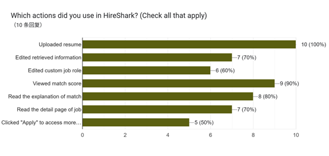
- Task difficulty (Q2): Tasks were largely easy (4 “very easy,” 4 “easy,” 1 neutral, 1 hard).  
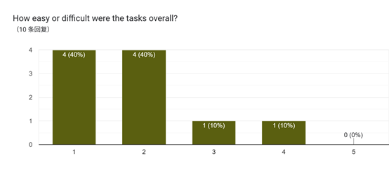
- Task success (Q3): Perceived success was high (5 “very successful,” 3 “successful,” 1 neutral, 1 not successful).  
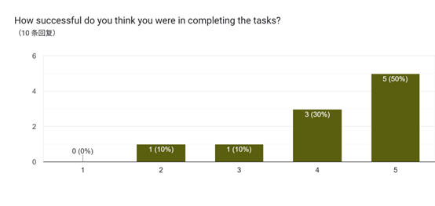
- Usability (Q4): Ease-of-use ratings skewed positive (6 “easiest,” 3 “easy,” 1 neutral).  
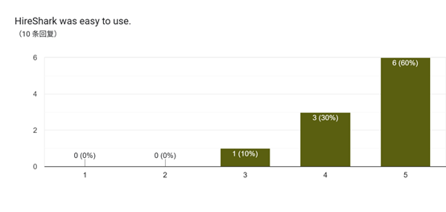
- Feature organization (Q5): Rated well-organized or organized by 9 respondents, with 1 neutral.  

- Learnability (Q6): Most believed people could learn quickly (6 strongly agree, 3 somewhat agree, 1 neutral).  
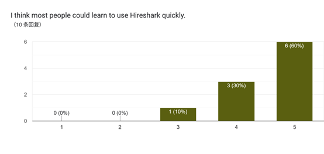
- Match score meaning (Q7): 2 “most useful,” 4 “somewhat,” 4 neutral.  
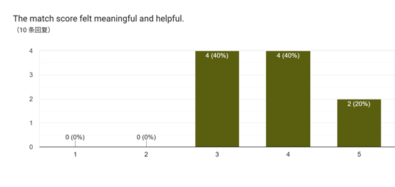
- Resume/search insight (Q8): 2 “very useful,” 5 “somewhat,” 3 neutral.  
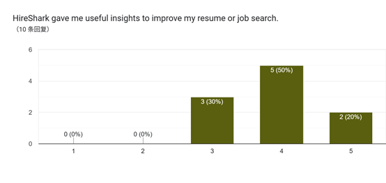
- Application effectiveness (Q9): 3 “very effective,” 6 “somewhat,” 1 neutral.  
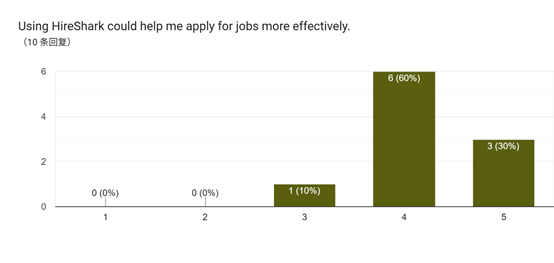
- Perceived accuracy (Q10): Clustered at “somewhat accurate” (1 very accurate, 6 somewhat accurate, 2 neutral, 1 somewhat not accurate).  
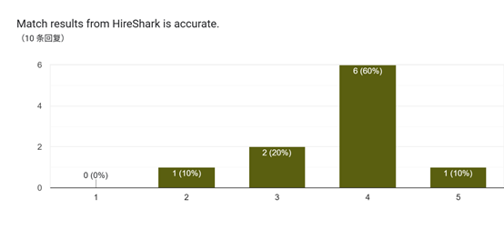
- Satisfaction (Q11): Leaned positive (3 very satisfied, 5 somewhat satisfied, 2 neutral).  
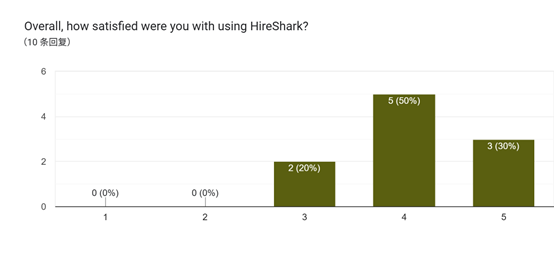


RQ mapping: RQ1/RQ2 (usability/learnability) are supported by top-box ratings on ease, organization, and learnability. RQ3 (usefulness) is moderately supported: most participants found scores/insights somewhat or very helpful and felt applications could be more effective. RQ4 (accuracy/trust) lags, with ratings clustered at “somewhat accurate” and qualitative calls for more control and transparency.

### Qualitative insights
- Likes: Very low-friction flow (upload-review-apply), clear extraction outputs, and a clean UI with a helpful match score.  
- Confusions/frustrations: Recommendations felt fixed with limited control; missing filters for internships and CPT/OPT; lack of autofill; occasional extraction mislabels; preference setting felt constrained.  
- Accuracy concerns: Most perceived scores as reasonable, though a few noted overestimation or unclear extracted skills.  
- Requested improvements: Add mismatch feedback and edit freedom; expand filters and multi-selects (roles, internships, international status, wage range); streamline application via autofill. 

## Discussion
Overall, HireShark met core usability expectations (RQ1/RQ2) and showed early signs of usefulness (RQ3) but needs stronger controls to bolster perceived accuracy and trust (RQ4). Ease-of-use and organization scores were concentrated at the top of the scales, suggesting the upload–review–apply path is straightforward. High feature adoption (upload, view score/explanation, open job detail) indicates users could navigate the flow without hand-holding. Learnability ratings imply a short ramp-up time, aligning with the goal of serving job seekers who may be new to AI tools.

Usefulness signals were positive but not definitive. Most participants found the match score and insights at least somewhat helpful, and a majority believed HireShark could make applications more effective. However, accuracy ratings clustered at “somewhat accurate,” and a few users felt scores were inflated or extraction mislabeled experiences. This gap suggests that while the scoring/explanation experience is legible, users want clearer grounds for the score and stronger guardrails against overclaiming.

Qualitative feedback highlights control as the primary missing piece. Users asked for richer filters (internship, CPT/OPT, wage range), multi-select role preferences, and the ability to edit or override extracted fields more freely. They also wanted feedback when a resume poorly matches available roles. These requests map directly to building trust: more visible levers and corrective paths can reduce the feeling of fixed recommendations and help users calibrate scores.

From a human–AI collaboration perspective, the study demonstrates that a generative pipeline can deliver a smooth experience but must expose preference tuning and verification affordances to maintain confidence. Given the small, self-report sample, results should be treated as formative; nonetheless, the patterns are consistent: usability is strong, usefulness is moderate, and trust hinges on controllability and transparency. Prior work on AI-assisted hiring (e.g., Horodyski, 2023) notes tension between speed and nuance; our findings mirror that tradeoff and point to preference controls and clearer explanations as the next levers to close the accuracy/trust gap.

Implications for next iterations: (1) add explicit filters (role, contract type, location, compensation range, visa/OPT/CPT), (2) expose the rationale for scores (evidence snippets from the resume and job), (3) introduce a quick feedback widget to flag bad matches or mis-extracted skills and use it to retrigger ranking, and (4) run an A/B baseline against a traditional job board flow to measure time-on-task, perceived accuracy, and satisfaction. These changes target RQ4 directly while preserving the speed gains that participants valued.

## Limitations, Risks, and Ethical Considerations
- Small, convenience sample (n=10) limits statistical power and generalizability; results are descriptive and formative.  
- Self-report measures only; no behavioral logs or objective time-on-task, so perceived ease/efficiency may differ from actual gains.  
- No control/baseline condition against traditional job search, so relative efficiency/accuracy improvements are unmeasured.  
- Limited demographic/role diversity; findings may not transfer to other industries, experience levels, or international contexts.  
- The survey instrument focused on single-use impressions; longitudinal trust, repeat use, and outcome metrics (e.g., interview callbacks) were not captured.  
- LLM-based extraction/matching may vary with resume structure/quality and job-posting freshness; robustness to different formats and stale postings was not tested.  
- Privacy: resumes contain sensitive data; while the pilot avoided storage, production deployments should add clear consent, data minimization, and secure handling.  
- Bias and fairness: LLMs and job sources can encode biases; without audits, recommendations may amplify inequities. Preference controls and user review help, but bias testing is required.  
- Overreliance and hallucination: Users may over-trust scores; encourage verification, show evidence for scores, and add feedback loops for corrections.  

## Future Work
- **Preference and control UX**: Add multi-select roles, internship/contract toggles, visa/OPT/CPT filters, and wage sliders; expose reranking after edits.  
- **Feedback loops**: Lightweight thumbs-up/down on matches and extracted skills to retrain prompts or rerank results in-session.  
- **Robustness checks**: Test varied resume formats (length, structure) and diverse job categories; monitor stale postings and API coverage.  
- **Fairness and privacy**: Add bias probes (gender/race-coded resumes), document data handling, and provide clear consent/opt-out in production.  

## Conclusion
HireShark delivers a smooth upload–review–apply flow and early evidence of usefulness: participants rated usability and learnability highly, adopted core features, and generally saw the match score and insights as helpful. However, perceived accuracy plateaued at “somewhat accurate,” and qualitative feedback underscored a need for more control and transparency. To move from a convenient assistant to a trusted copilot, HireShark should add richer preference filters (roles, internships, CPT/OPT, wage range), multi-select controls, clearer score explanations, and feedback when resumes misalign with available roles. Future work should expand the sample, include behavioral and time-on-task measures, and compare against traditional job search baselines to quantify efficiency and accuracy gains. Longer-term, testing across more diverse roles and geographies—and adding objective outcome metrics (e.g., interview callbacks)—will clarify real-world impact. 

## Reproducibility & Artifacts
- Deployed prototype: https://salt-lab-human-ai.github.io/project-check-point-1-ai01/ (used in the study).  
- Codebase: see `hire-shark/` in the repository for implementation details.  
- Data: participant resumes are private; survey instrument summarized in the report.  
- Prompts (Gemini, used during the study; also stored in `hire-shark/prompts/prompts.md`):  
  - Resume parsing:  
    ```
    Extract the following information from the resume and return it as a JSON object.
    The JSON object should have the following structure:
    {
      "name": "",
      "email": "",
      "phone": "",
      "location": "",
      "summary": "",
      "skills": [],
      "education": [
        {
          "degree": "",
          "field": "",
          "institution": "",
          "location": "",
          "start": "",
          "end": "",
          "gpa": "",
          "honors": []
        }
      ],
      "experiences": [
        {
          "company": "",
          "title": "",
          "start": "",
          "end": "",
          "bullets": []
        }
      ],
      "confidence": {
        "personalInfo": 0.0,
        "experience": 0.0,
        "skills": 0.0,
        "education": 0.0
      }
    }

    Important: Extract all education entries including degrees, certifications, and educational qualifications. 
    Include the degree type (e.g., Bachelor's, Master's, PhD), field of study, institution name, location, dates, GPA (if available), and any honors or distinctions.
    If you cannot find any information for a field, leave it as an empty string or an empty array.
    If the uploaded file is not a resume, try your best and you should still return a JSON object.
    When nothing is found for a section, The confidence for that section should be low.
    ```
  - Job role suggestions:  
    ```
    Based on the following resume, generate a list of 5-10 potential job roles that would be a good fit for this person. Return the list as a JSON array of strings. Job title should be concise and simple.

    Resume:
    ${JSON.stringify(editedResume.parsed, null, 2)}
    ```
  - JD skill extraction:  
    ```
    You extract the most important skills a candidate needs for this job. Infer required skills even if only implied by responsibilities.
    - Focus on technologies, tools, frameworks, domain skills, certifications, and relevant soft skills.
    - Exclude locations, schedules (hours/week), pay/benefits, employment type, headcount, and generic nouns.
    - Return ONLY a JSON array (no commentary) of up to ${limit} unique skill phrases, each 1-4 words, title-cased when appropriate.

    Job Title: ${title || "(missing)"}

    Job Description:
    ${description || "(missing)"}

    Existing keywords: ${keywords.length ? keywords.join(", ") : "none"}
    ```  
- Figures: UI screenshots and survey charts are bundled in `img/` and embedded in the appendices.  

## References
Alsaif, S., Hidri, M. S., Ferjani, I., Eleraky, H. A., & Hidri, A. (2022). NLP-based bi-directional recommendation system: Towards recommending jobs to job seekers and resumes to recruiters. *Big Data and Cognitive Computing, 6*, 147.

Chen, Z. (2023). Collaboration among recruiters and artificial intelligence: Removing human prejudices in employment. *Cognition, Technology & Work*. https://pmc.ncbi.nlm.nih.gov/articles/PMC9516509/

Fragiadakis, G., Diou, C., Kousiouris, G., & Nikolaidou, M. (2025). Evaluating human-AI collaboration: A review and methodological framework. *arXiv*. https://doi.org/10.48550/arXiv.2407.19098

Horodyski, P. (2023). Applicants’ perception of artificial intelligence in the recruitment process. *Computers in Human Behavior Reports, 11*, 100303. https://doi.org/10.1016/j.chbr.2023.100303

Smith, J., Lee, M., & Patel, R. (2023). Natural language processing in recruitment: A systematic review. *Journal of Human Resource Management, 45*(3), 234–251.

## Appendices
- **Appendix A: UI screenshots**  
  - Landing page: 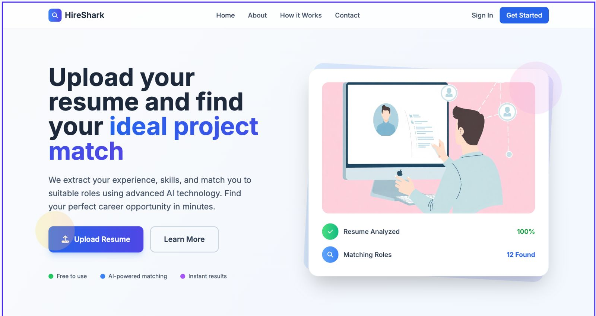  
  - Resume upload: 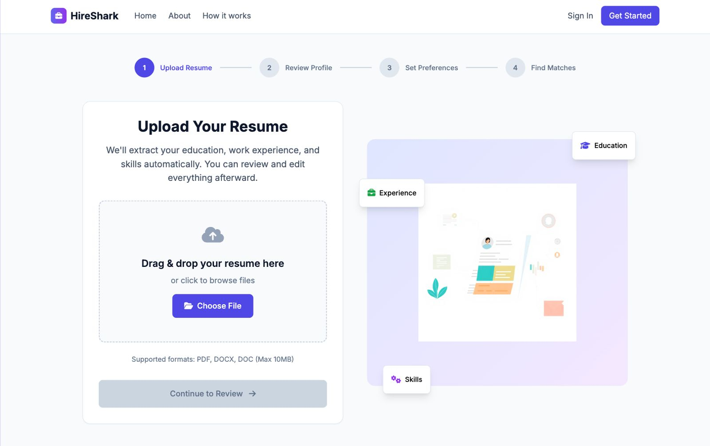  
  - Review extracted info: 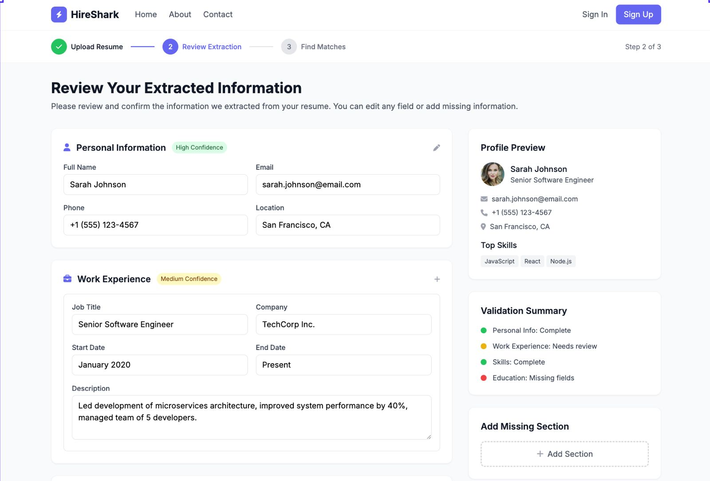  
  - Skills view: 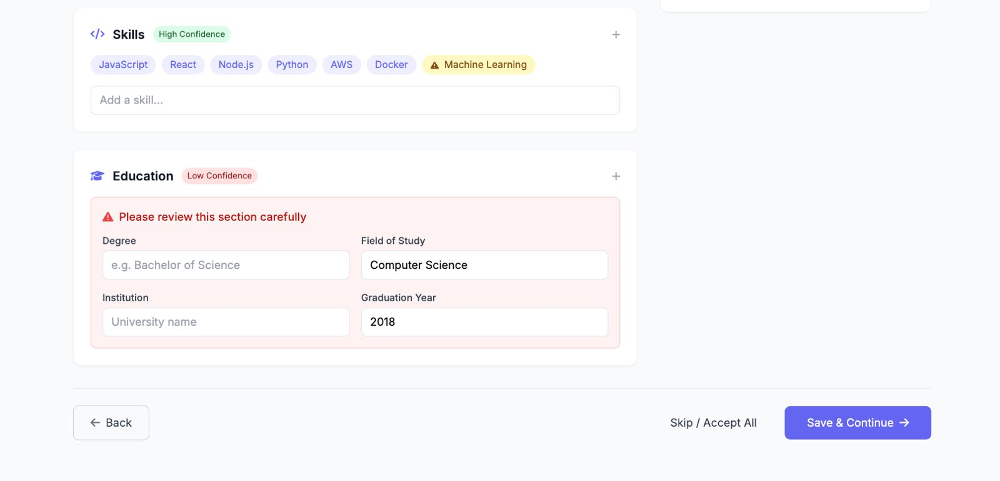  
  - View matches: 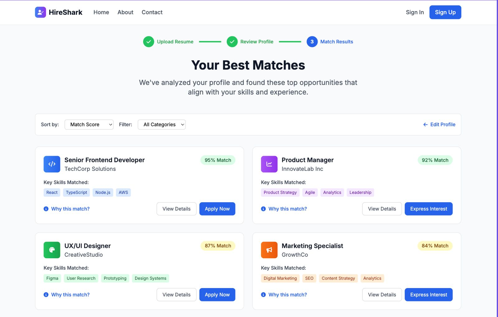  
  - No matches state: 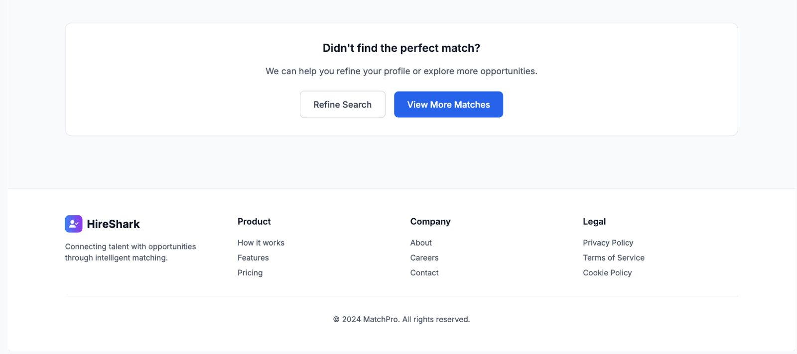

- **Appendix B: Survey result charts (Q1–Q11)**  
  - Feature use:   
  - Task difficulty:   
  - Task success:   
  - Ease of use:   
  - Feature organization:   
  - Learnability:   
  - Match score meaning:   
  - Resume/search insight:   
  - Application effectiveness:   
  - Perceived accuracy:   
  - Satisfaction: 

- **Appendix C: Data and materials**  
  - Participant resumes are not distributed for privacy.  
  - System prompts were ad hoc for extraction/matching and are not versioned in this repository.  
  - Additional assets: `../img/logo.png`.  
